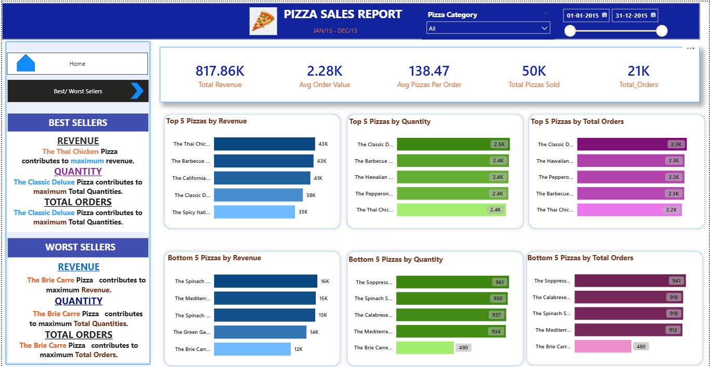

# 🍕 Pizza Sales Analysis | SQL + Power BI

## 📊 Dashboard Preview

### Home Page – Sales Overview


### Best & Worst Sellers Analysis


---

## 📌 Project Overview

This project performs an end-to-end sales analysis on 21,000+ transactional pizza sales records to identify revenue trends, customer behavior patterns, and product performance insights using SQL Server and Power BI.

The objective was to convert raw sales data into structured business intelligence through KPI calculations, data modeling, and interactive dashboard reporting.

---

## 🛠 Tools & Technologies Used

- SQL Server (Data extraction & aggregation)
- Power BI (Data visualization & dashboard creation)
- DAX (KPI measures & calculations)
- Excel (Data validation & preprocessing)

---

## 📊 Key Business Metrics

- Total Revenue: 817.86K
- Total Orders: 21K
- Total Pizzas Sold: 50K
- Average Order Value: 2.28K
- Average Pizzas per Order: 138.47

---

## 📈 Dashboard Features

### 1️⃣ Sales Overview
- Daily order trend analysis
- Monthly sales trend with date hierarchy
- Revenue distribution by category
- Revenue distribution by pizza size
- Category-wise total pizzas sold
- Interactive filters (Date range & Pizza Category)

### 2️⃣ Best & Worst Sellers Analysis
- Top 5 pizzas by Revenue
- Top 5 pizzas by Quantity
- Top 5 pizzas by Total Orders
- Bottom 5 pizzas by Revenue
- Bottom 5 pizzas by Quantity
- Bottom 5 pizzas by Total Orders

---

## 🗄 SQL Analysis Performed

- GROUP BY aggregations
- SUM(), COUNT(), AVG() calculations
- Date-based analysis (MONTH, DAY)
- Percentage contribution calculation
- Category and size performance comparison

### Example Query

```sql
SELECT 
    pizza_size,
    SUM(total_price) AS total_sales,
    CAST(SUM(total_price) * 100.0 /
        (SELECT SUM(total_price) FROM pizza_sales)
    AS DECIMAL(10,2)) AS percentage_of_sales
FROM pizza_sales
GROUP BY pizza_size;

## 💡 Key Insights
- Large-size pizzas generated the highest revenue share.
- Classic category contributed the highest overall sales.
- Sales volume peaks during weekends.
- Maximum orders observed in July and January.
- Certain low-performing pizzas consistently contribute minimal revenue and order volume.

---

## 🎯 Skills Demonstrated
- Writing optimized SQL queries for business metrics
- Creating DAX measures for KPIs
- Implementing date hierarchy and drill-down analysis
- Data modeling in Power BI
- Dashboard storytelling & business insight generation


